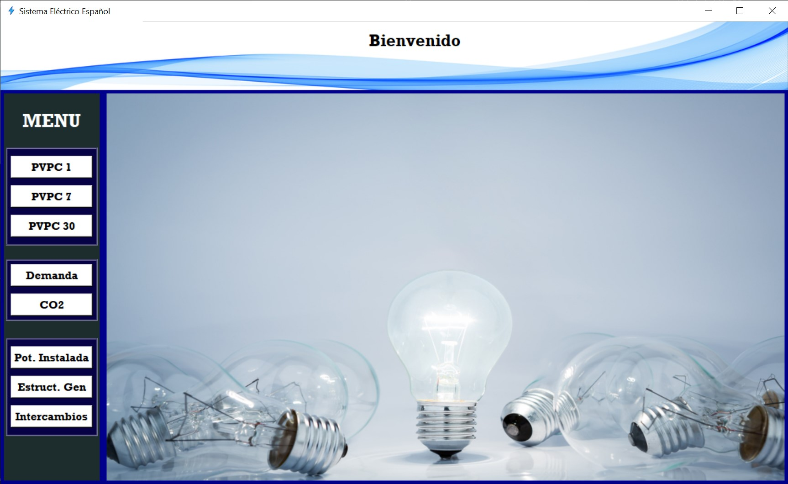
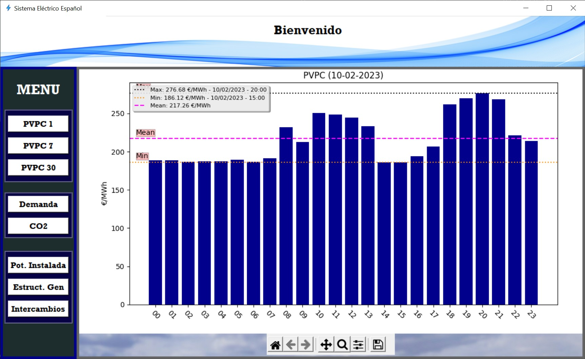
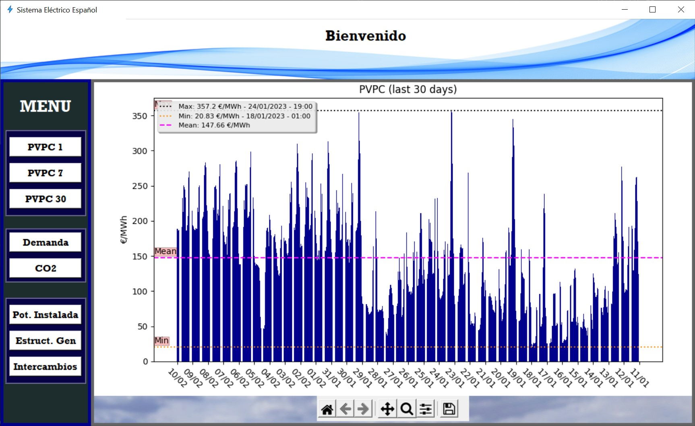
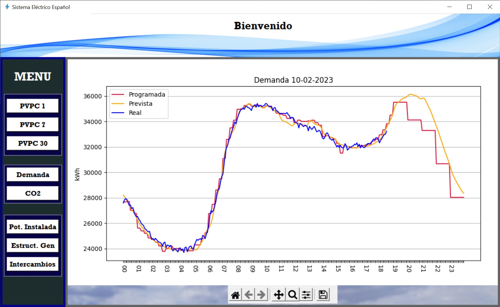
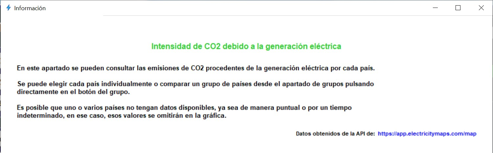

# Sistema-Electrico

[](https://www.python.org/downloads/release/python-3102/)


<p align = "center">
<a href="https://github.com/FranGarcia94/Sistema-Electrico"></a>
</p>
<p align = "center">
<b>Sistema Eléctrico Español.</b>
</p>

# **Índice**   
[Introducción](#introducción)

[Funciones](#funciones)

- [PVPC](#pvpc)

    1. [PVPC Día actual](#pvpc-día-actual)

    2. [PVPC Últimos 7 días](#pvpc-últimos-7-días)

    3. [PVPC Últimos 30 días](#pvpc-últimos-30-días)

- [Demanda](#demanda)

- [Emisiones de CO<sub>2</sub>](#emisiones-de-co2)

- [Potencia Instalada](#pontencia-instalada)

- [Estructura de Generación](#estructura-de-generación)

- [Intercambios](#intercambios)

[Conclusiones](#conclusiones)


# Introducción

El sistema eléctrico de un país lo podemos definir como un conjunto de entidades coordinadas entre sí cuyas funciones son, principalmente, la generación, transporte, distribución y comercialización de eléctricidad.

Este programa desarrollado en Python permite conocer algunos de los datos fundamentales del sistema eléctrico español (peninsular únicamente) en forma de gráficas, a través de una interfaz gráfica de usuario muy sencilla e intuitiva.



Se pueden obtener datos[^1] históricos, para ver la evolución del sistema, cual es la tendencia del mismo y poder tomar decisiones en consecuencia, sin embagro, uno de los atractivos de esta interfaz es la capacidad de conocer datos actuales. 

Veamos sus funciones.

# Funciones

## PVPC

Precio Voluntario al Pequeño Consumidor, es el precio máximo que ciertas comercializadoras podrán cobrar a los consumidores que quieran acogerse a esta tarifa. Es una las principales opciones de contratación de los hogares españoles contando con cerca de un [40%](https://www.ree.es/es/actividades/operacion-del-sistema-electrico/precio-voluntario-pequeno-consumidor-pvpc#:~:text=En%20la%20actualidad%2C%20se%20calcula,millones%20est%C3%A1n%20acogidos%20al%20PVPC.) de los consumidores domésticos.

Esta es una tarifa regulada por el gobierno y consta de dos partes bien diferenciadas, el precio en el mercado diario [OMIE](https://www.omie.es/) + peajes de acceso e impuestos.

Debido a la estructura del propio mercado diario y de las regulaciones del gobierno, el [PVPC](https://www.esios.ree.es/es/pvpc) tiene una estructura de precios horaria, es decir, existe un precio diferente para cada hora del día.

1. ### PVPC Día actual

    

    Precio horario del PVPC en el día actual (día de la consulta). Este apartado viene especialmente bien a la hora de organizar consumos elevados a lo largo del día como poner la lavadora, hacer la comida o incluso programar los aparatos de calefacción/aire acondicionado para funcionar en las horas más baratas.

2. ### PVPC Últimos 7 días

    

3. ### PVPC Últimos 30 días

    

    Como vemos, podemos obtener el PVPC en un periodo de n días, con ello podemos estudiar como evolucionan los precios, si sigue siendo rentable esta tarifa o hacernos una idea del precio de nuestra siguiente factura.

    Podemos cambiar la cantidad de días en las siguientes líneas de código:
    ```python

    pvpc1_btn = Button(pvpc_frame, text = 'PVPC 1', command = lambda: pvpc1_fun(1))
    pvpc1_btn.grid(row = 0, column = 0, padx = 5, pady = 10)

    pvpc7_btn = Button(pvpc_frame, text = 'PVPC 7', command = lambda: pvpc1_fun(7))
    pvpc7_btn.grid(row = 1, column = 0, padx = 5, pady = 0)

    pvpc30_btn = Button(pvpc_frame, text = 'PVPC 30', command = lambda: pvpc1_fun(30))
    pvpc30_btn.grid(row = 2, column = 0, padx = 5, pady = 10)

    ```

    Como vemos, con la función lambda llamamos a la función `pvpc1_fun(n)` donde le pasamos el parámetro `n` siendo este el número de días de los que queremos obtener datos.

## Demanda



Aquí se observa la demanda de electricidad en tiempo real, gestionar la demanda es función de [REE](https://www.ree.es/es) y podemos ver la [demanda](https://demanda.ree.es/visiona/peninsula/demandaqh/total) real de energía, la demanda prevista y programada.

## Emisiones de CO<sub>2</sub>

Este es un apartado un tanto especial, aquí podemos obtener la cantidad de CO<sub>2</sub> emitido a la atmósfera debido exclusivamente a la generación de energía. 

Con el auge de las renovables  y el problema medioambiental la mayoría de países del mundo se han comprometido a bajar las emisiones de dióxido de carbono y para ello apuestan cada vez más por energías limpias, además existen instumentos financieros encargados de favorecer que esto suceda como es el caso de los [derechos de emisión de CO<sub>2</sub>](https://energia.gob.es/desarrollo/Medioambiente/CambioClimatico/Paginas/Comerciodederechosdeemision.aspx).

En este apartado podemos ver en tiempo real (aproximadamente ya que depende del último momento de toma de datos) la cantidad de CO<sub>2</sub> emitada por diferentes países.


Con el desplegable podremos elegir uno de esos países y que muestre el valor de `[gCO2eq/kWh]` que está emitiendo. 

|||
|---|---|
|||

Este valor aislado por sí solo puede no decirnos nada ya que es probable que no sepamos que valores son "normales", es por eso que está la pestaña grupos, en ella podemos crear nuestro grupo de países (desde el código) y compararlos. Para crear un grupo solo hay que añadir un nuevo botón copiando estás dos líneas:
```python

    europe_btn = Button(datils_lbf, text = 'Europa', bg = 'white', activebackground = 'green', activeforeground = 'black', width = 11, font = ('Rockwell 12 bold'), command = lambda: co2_calcul({'España' : 'ES', 'Portugal' : 'PT', 'Francia' : 'FR', 'Bélgica' : 'BE', 'Italia' : 'IT', 'Alemania' : 'DE', 'Austria' : 'AT', 'Chequia' : 'CZ', 'Eslovaquia' : 'SK', 'Polonia' : 'PL', 'Ucrania': 'UA', 'Hungría' : 'HU', 'Estonia' : 'EE', 'Letonia' : 'LV', 'Lituania': 'LT', 'Rumanía': 'RO', 'Finlandia' : 'FI', 'Gran Bretaña' : 'GB', 'Dinamarca' : 'DK', 'Grecia' : 'GR', 'Croacia' : 'HR', 'Albania': 'AL', 'Montenegro': 'ME','Países Bajos' : 'NL', 'Suecia' : 'SE', 'Noruega' : 'NO'}))

    europe_btn.pack(padx = 5, pady = 5)

```
Insertando los países deseados junto con sus iniciales (lista de países e iniciales [aquí](https://api.electricitymap.org/v3/zones)) en `co2_calcul()` respetando el formato. También habría que cambiar el parámetro `text` y poner un nombre distinto y por último añadir `nuevo_btn.pack()`


En esta gráfica tenemos el resultado obtenido de los países de Europa de los que se tenían datos en ese momento y podemos ver como países como Polonia o Chequia estaban generando la mayor parte de su electricidad a partir de combustibles fósiles y como España o Francia, cuyas propuestas energéticas se orientan por un lado en las energías renovables y por otro en estas últimas más nuclear, sus emisiones son considerablemente menores. Hay que decir que para sacar conclusiones representativas habría que estudiar dichas emisiones durante al menos un año para ver su comportamiento en las diferentes estaciones y que no sean situaciones aisladas.

1. ### Información
    
    Este apartado tiene un botón de información para aclarar un poco más su significado. Si lo pulsamos aparecerá lo siguiente:
    

## Pontencia Instalada

Aquí se muestra la potencia instalada en España dividida por tecnologías para los 5 años anteriores.


Resulta evidente el proceso de descarbonización que está llevando a cabo España y su fuerte apuesta por las energías renovables, destacando la eólica y la solar fotovoltaica.

## Estructura de Generación

En este caso lo que tenemos es la estructura de generación de España dividida por tecnologías para los 5 años anteriores.


Aquí hay varias cosas importantes donde destacaría, en primer lugar, como se ha comentado en el apartado anterior, el auge de las renovables en detrimento del carbón y el gran peso que tiene la energía nuclear lo cúal es más sorprendente si lo comparamos con la potencia instalada.

## Intercambios


Aquí vemos el saldo neto de los intercambios de energía de España en estos últimos 5 años con las diferentes fronteras españolas. Si el valor es positivo, indica que ha habido más importación que exportación y viceversa.

# Conclusiones

Hemos visto que es una aplicación sencilla, intuitiva y polivalente, sirve para hacerse una idea de como está el sistema eléctrico español, de su tendencia y de forma indirecta de la situación del mercado energético. Además, estos datos se pueden utilizar para automatizar procesos, analizar datos, tomar decisiones, domótica del hogar, etc.


[^1]: Los datos son obtenidos de las APIs de [REE](https://www.ree.es/es/apidatos) y [CO2signal](https://www.co2signal.com/) ([electricitymaps](https://www.electricitymaps.com/)), para esta última es necesario obtener una API Key, es gratuito y solo hay que registrarse en su página web donde está toda la información, aunque evidentemente este plan gratuito tiene sus limitaciones en cuanto a datos a los que se pueden acceder y a la cantidad de peticiones por hora.


