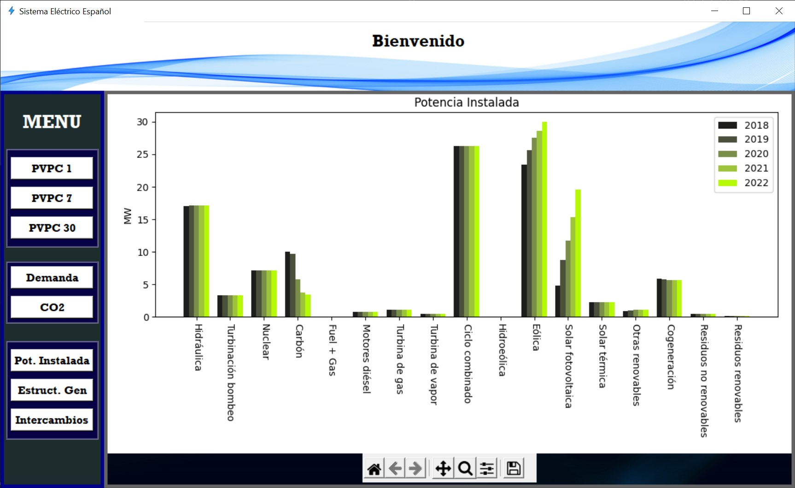

# Spanish Electrical System

[](https://www.python.org/downloads/release/python-3102/)


<p align = "center">
<a href="https://github.com/FranGarcia94/Sistema-Electrico"></a>
</p>
<p align = "center">
<b>Spanish Electrical System</b>
</p>

# **Table of contents**   
[Introduction](#introduction)

[Functions](#functions)

- [PVPC](#pvpc)

    1. [PVPC Current Day](#pvpc-current-day)

    2. [PVPC Last 7 Days](#pvpc-last-7-days)

    3. [PVPC Last 30 days](#pvpc-last-30-days)

- [Demand](#demand)

- [CO<sub>2</sub> Emissions](#co2-emissions)

- [Installed Power](#installed-power)

- [Generation Structure](#generation-structure)

- [Exchanges](#exchanges)

[Conclusions](#conclusions)


# Introduction

The electrical system of a country can be defined as a set of coordinated entities whose functions are, mainly, the generation, transmission, distribution and commercialization of electricity.

This program developed in Python allows to know some of the fundamental data of the Spanish electricity system (peninsular only) in the form of graphs, through a very simple and intuitive graphical user interface.


Historical data[^1] can be obtained, to see the evolution of the system, which is the trend of it and to be able to make decisions accordingly, however, one of the attractions of this interface is the ability to know current data. 

Let's see its functions.

# Functions

## PVPC

Voluntary Price for Small Consumers (in Spanish: Precio Voluntario al Pequeño Consumidor) is the maximum price that certain marketers may charge consumers who wish to take advantage of this tariff. It is one of the main contracting options for Spanish households, accounting for around [40%](https://www.ree.es/es/actividades/operacion-del-sistema-electrico/precio-voluntario-pequeno-consumidor-pvpc#:~:text=En%20la%20actualidad%2C%20se%20calcula,millones%20est%C3%A1n%20acogidos%20al%20PVPC.) of domestic consumers.

This is a government regulated tariff and consists of two distinct parts, the daily market price [OMIE](https://www.omie.es/) + access tolls and taxes.

Due to the structure of the day-ahead market itself and government regulations, the [PVPC](https://www.esios.ree.es/es/pvpc) has an hourly price structure, i.e. there is a different price for each hour of the day.

1. ### PVPC Current Day

    

    Hourly price of the PVPC on the current day (day of consultation). This section is particularly useful when organizing high consumption throughout the day, such as doing the washing machine, cooking meals or even programming heating/cooling appliances to operate during the cheapest hours.

2. ### PVPC Last 7 days

    

3. ### PVPC Last 30 days

    

    As we can see, we can obtain the PVPC in a period of n days, with this we can study how prices evolve, if this tariff is still profitable or get an idea of the price of our next bill.

    We can change the number of days in the following lines of code:
    ```python

    pvpc1_btn = Button(pvpc_frame, text='PVPC 1', command = lambda: pvpc1_fun(1))
    pvpc1_btn.grid(row=0, column=0, padx=5, pady=10)

    pvpc7_btn = Button(pvpc_frame, text='PVPC 7', command = lambda: pvpc1_fun(7))
    pvpc7_btn.grid(row=1, column=0, padx=5, pady=0)

    pvpc30_btn = Button(pvpc_frame, text='PVPC 30', command = lambda: pvpc1_fun(30))
    pvpc30_btn.grid(row=2, column=0, padx=5, pady=10)

    ```

    As we can see, with the lambda function we call the function `pvpc1_fun(n)` where we pass the parameter `n` being the number of days for which we want to obtain data.

## Demand


Here we observe the real-time electricity demand, manage the demand is a function of [REE](https://www.ree.es/es) and we can see the actual [demand](https://demanda.ree.es/visiona/peninsula/demandaqh/total) of energy, the forecasted and programmed.

## CO<sub>2</sub> Emissions

This is a somewhat special section, here we can obtain the amount of CO<sub>2</sub> emitted to the atmosphere due exclusively to energy generation.  

With the rise of renewables and the environmental problem, most countries in the world are committed to lowering carbon dioxide emissions and are increasingly opting for clean energies, and there are also financial instruments to encourage this to happen, such as the [CO<sub>2</sub> emission rights](https://energia.gob.es/desarrollo/Medioambiente/CambioClimatico/Paginas/Comerciodederechosdeemision.aspx).

In this section we can see in real time (approximately since it depends on the last moment of data collection) the amount of CO<sub>2</sub> emitted by different countries.


With the drop-down menu we can choose one of these countries and display the value of [gCO2eq/kWh] it is emitting. 

|||
|---|---|
|||

This isolated value alone may not tell us anything since we probably do not know which values are "normal", that is why there is the tab groups, in it we can create our group of countries (from the code) and compare them. To create a group just add a new button by copying these two lines:
```python

    europe_btn = Button(datils_lbf, text = 'Europa', bg = 'white', activebackground = 'green', activeforeground = 'black', width = 11, font = ('Rockwell 12 bold'), command = lambda: co2_calcul({'España' : 'ES', 'Portugal' : 'PT', 'Francia' : 'FR', 'Bélgica' : 'BE', 'Italia' : 'IT', 'Alemania' : 'DE', 'Austria' : 'AT', 'Chequia' : 'CZ', 'Eslovaquia' : 'SK', 'Polonia' : 'PL', 'Ucrania': 'UA', 'Hungría' : 'HU', 'Estonia' : 'EE', 'Letonia' : 'LV', 'Lituania': 'LT', 'Rumanía': 'RO', 'Finlandia' : 'FI', 'Gran Bretaña' : 'GB', 'Dinamarca' : 'DK', 'Grecia' : 'GR', 'Croacia' : 'HR', 'Albania': 'AL', 'Montenegro': 'ME','Países Bajos' : 'NL', 'Suecia' : 'SE', 'Noruega' : 'NO'}))

    europe_btn.pack(padx = 5, pady = 5)

```
Inserting the desired countries together with their initials (list of countries and initials [here](https://api.electricitymap.org/v3/zones)) in `co2_calcul()` respecting the format. You should also change the `text` parameter and put a different name and finally add `new_btn.pack()`.


In this graph we have the result obtained from the European countries for which data were available at that time and we can see how countries such as Poland or the Czech Republic were generating most of their electricity from fossil fuels and how Spain or France, whose energy proposals are oriented on the one hand in renewable energies and on the other hand in the latter more nuclear, their emissions are considerably lower. It must be said that in order to draw representative conclusions it would be necessary to study these emissions for at least one year to see how they behave in the different seasons and that they are not isolated situations.

1. ### Information
    
    This section has an information button to clarify its meaning a little more. If we click on it, the following will appear:
    

## Installed Power

Here is the installed power in Spain divided by technology for the previous 5 years.



It is evident the decarbonization process that Spain is carrying out and its strong commitment to renewable energies, highlighting wind and solar photovoltaic.

## Generation Structure

In this case what we have is the generation structure of Spain divided by technologies for the previous 5 years.


Here there are several important things where I would highlight, first, as discussed in the previous section, the rise of renewables to the detriment of coal and the great weight that has nuclear energy which is more surprising if we compare it with the installed power.

## Exchanges


Here we see the net balance of Spain's energy exchanges in the last 5 years with the different Spanish borders. If the value is positive, it indicates that there have been more imports than exports and vice versa.

# Conclusions

We have seen that it is a simple, intuitive and versatile application, useful to get an idea of how the Spanish electricity system is, of its trend and indirectly of the situation of the energy market. In addition, this data can be used to automate processes, analyze data, make decisions, home automation, etc.


[^1]: The data are obtained from the APIs of [REE](https://www.ree.es/es/apidatos) and [CO2signal](https://www.co2signal.com/) ([electricitymaps](https://www.electricitymaps.com/)), for the latter it is necessary to obtain an API Key, it is free and you only have to register on their website where all the information is, although obviously this free plan has its limitations in terms of data that can be accessed and the number of requests per hour.

